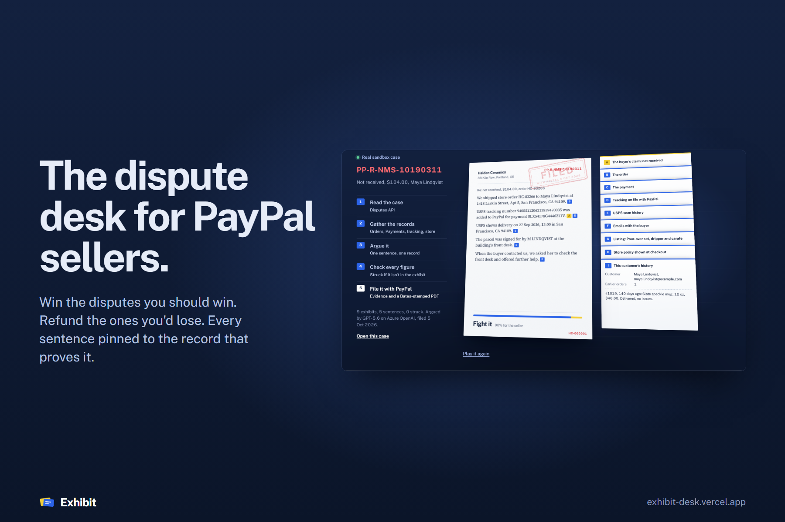
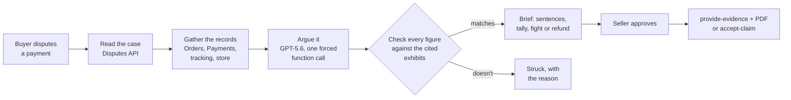

<p align="center"></p>

<h1 align="center">Exhibit</h1>
<p align="center"><b>The dispute desk for PayPal sellers.</b> Win the disputes you should win. Refund the ones you'd lose.</p>

<p align="center">
  <a href="https://exhibit-desk.vercel.app"><b>Live demo</b></a> ·
  <a href="https://exhibit-desk.vercel.app/new">Open a sandbox case</a> ·
  <a href="https://exhibit-desk.vercel.app/desk">The desk</a> ·
  <a href="#how-it-works">How it works</a>
</p>

<p align="center">
  <a href="https://github.com/RohanGlitched/exhibit/actions/workflows/ci.yml"></a>
  
  
  
</p>

When a buyer says a parcel never arrived, a small seller has about ten days to answer PayPal. Answering means digging out the order, the payment, the tracking, the carrier's scans and the emails, and writing it up. Many sellers don't, and lose cases they should have won. Others fight cases they can't win and pay for it.

**Exhibit reads each dispute, gathers every record behind it as a numbered exhibit, and writes the response one sentence at a time, each sentence pinned to the record that proves it.** It tallies the points for each side, tells you to fight or to refund, and files your choice with PayPal in one click: the evidence with a Bates-stamped PDF of every exhibit, or an accepted claim.

The model argues; the records decide what it's allowed to say. Before anything is filed, every amount, date, time, tracking number and id in a sentence must appear in the exhibits that sentence cites, or the sentence is struck.

## Try it in one minute

1. Open **[exhibit-desk.vercel.app/new](https://exhibit-desk.vercel.app/new)** and pick a story, for example *"It never arrived", but the carrier says delivered*.
2. Exhibit takes a real sandbox card payment to the demo shop, adds the tracking number and has the card issuer file a chargeback through PayPal. You land on the case as the seller and watch it argued live.
3. Hover any exhibit to see which sentences rely on it. Click **File the response** (or **Accept and refund** on the cases you should lose), then **Read the PDF** that went to PayPal.

No sign-up. Everything runs in the PayPal sandbox with test money; the shop, Halden Ceramics, and its buyers are fictional.

| Story | What the records show | Exhibit's call |
|---|---|---|
| "It never arrived" | USPS delivered and signed for at the buyer's address | Fight it |
| Small order, no tracking | Shipped First-Class without tracking; two unanswered emails | Refund it |
| "Not as described": glaze colour | The listing disclosed the colour shift; a return was offered | Fight it |
| "I didn't make this purchase" | First order, shipped to a parcel forwarder, billing in another state | Refund it |
| "Charged twice" | The duplicate charge was refunded in full the next day (a real PayPal refund) | Fight it |

Exhibit is never told which story you picked. It only sees the records.

## How it works



1. **Read the case.** `GET /v1/customer/disputes/{id}`: reason, amount, stage, deadline, and the HATEOAS links that say which responses PayPal will take right now. Exhibit only offers an action when PayPal's links allow it.
2. **Gather the records.** `GET /v2/checkout/orders/{id}` (items, ship-to, trackers), `GET /v2/payments/captures/{id}` (amount, fees, the issuer's address and security-code checks), `GET /v2/payments/refunds/{id}` (when a refund exists), plus the store's own records: carrier scans, the inbox, the listing, the policy shown at checkout and the customer's history. Each becomes a lettered exhibit with its source.
3. **Argue it.** The exhibits go to GPT-5.6 on Azure OpenAI (Responses API) with one forced function call, `write_brief`: a recommendation (only the moves PayPal allows for this stage), three to seven weighted points for each side, and four to six response sentences, each with the letters of the exhibits that prove it.
4. **Check every sentence.** [`lib/cases/verify.ts`](lib/cases/verify.ts) extracts every amount, date, time, id and tracking number from a sentence and requires each to appear in the exhibits it cites (a date written with a time must match one record's date and time together). Uncited or unmatched sentences are struck before filing, and the brief shows why. The odds come from the tally's weights, not from the model.
5. **File it.** `POST /v1/customer/disputes/{id}/provide-evidence` (multipart: the response as notes, tracking or refund details, and a PDF with every exhibit Bates-stamped HC-000001…), or `POST /accept-claim` for a full refund. In the sandbox, `POST /adjudicate` then asks PayPal's simulator for a ruling.

If the model is unavailable or the day's budget is spent, a rules engine argues from the same exhibits through the same checks, so the desk never stops.

### Opening cases without a browser

Every case on the desk was opened with three sandbox calls and no human:

| Step | Call |
|---|---|
| The buyer pays the shop | `POST /v2/checkout/orders` with `intent: CAPTURE` and a PayPal test card (one call, returns `COMPLETED`) |
| The shop ships it | `POST /v2/checkout/orders/{id}/track` |
| "Charged twice" only: the double click and its refund | a second order, then `POST /v2/payments/captures/{id}/refund` |
| The issuer files a chargeback | `POST /v2/customer-support/process-chargeback` (sandbox only), with Visa or Mastercard reason codes that PayPal maps to *not received* (13.1, 4855), *not as described* (C2), *unauthorised* (4837) and *duplicate* (4834) |

PayPal reviews a new chargeback for five to eight minutes before the seller can respond, so a cron keeps two cases per story opened ahead of time (`POST /api/pool`), and a visitor is handed one that's ready.

## Run it yourself

```bash
git clone https://github.com/RohanGlitched/exhibit && cd exhibit
npm install
cp .env.example .env.local   # PayPal sandbox app keys, Azure OpenAI deployment
npm run dev -- --port 3600
```

- **PayPal:** a sandbox REST app (Merchant) on a **US** sandbox business account, with *Customer disputes* and *Transaction search* ticked. Accounts registered elsewhere may not be able to take card payments.
- **Model:** any Azure OpenAI GPT-5.x deployment that supports the Responses API. Without one, the rules engine argues.
- **Storage:** a private Vercel Blob store (`BLOB_READ_WRITE_TOKEN`); without it, case records go to `.data/`.

```bash
npm run typecheck
npm test                                      # the fact-checker's tests
node scripts/e2e.cjs http://localhost:3600     # open, argue and file a case in a real browser
```

## Code map

| Path | What it is |
|---|---|
| [`lib/paypal/`](lib/paypal) | Sandbox REST client (token cache, retries, one plain sentence per PayPal error), Orders, Payments, Tracking and Disputes |
| [`lib/cases/exhibits.ts`](lib/cases/exhibits.ts) | Turns PayPal and store records into lettered exhibits |
| [`lib/cases/brief.ts`](lib/cases/brief.ts) | The model call and its schema, and the rules engine |
| [`lib/cases/verify.ts`](lib/cases/verify.ts) | No claim without a record: the sentence checker and the odds |
| [`lib/cases/pdf.ts`](lib/cases/pdf.ts) | The Bates-stamped PDF filed with the evidence |
| [`lib/cases/open.ts`](lib/cases/open.ts) | Opening sandbox cases and the ready pool |
| [`components/hero/CaseFile.tsx`](components/hero/CaseFile.tsx) | The case file on the desk: the letter writes itself as exhibits lift from the stack |
| [`components/brief/PinnedBrief.tsx`](components/brief/PinnedBrief.tsx) | The brief with threads from each sentence to its exhibits |
| [`components/desk/DeskGrid.tsx`](components/desk/DeskGrid.tsx) | The desk, in AG Grid |

## Honest notes

- Sandbox only. Payments, tracking, chargebacks, evidence, acceptances and rulings are real sandbox API calls; the carrier scans, inbox, listing and order book belong to the fictional shop, and each exhibit says where it came from.
- A sandbox payment is made when a case is opened, so the store's order dates (from its records) are earlier than PayPal's payment timestamps. The exhibits say so.
- In the sandbox nobody at PayPal reads evidence. The ruling Exhibit requests follows its own filing: for the seller when it fought with the records on its side, for the buyer when it accepted.
- Spend guards: twelve briefs per visitor per ten minutes, a daily cap on model calls, and eight case openings per visitor per hour.

## License

MIT
